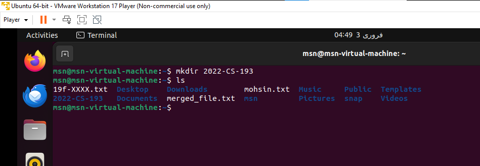

# TASK 1
In this Qustion we created a file, edit it and display the content on screen.

In this Qustion we are editing the file created using nano command.

In this Qustion we just create a file by our name and edit and displalys its content.

In this Qustion we are editing the file created using nano command.

In this Qustion  we merge two files previously created.

In this Qustion we are redirecting that output to a new file.

In this Qustion we are showing only top two lines of the file first created.

In this Qustion we are showing only last two lines of the file created before.

In this Qustion we find a string in the file.

In this Qustion we are granting execute permission of second file to group.

In this Qustion we are are removing the write permission to the user.

In this Qustion we are are displaying the current path of user.

In this Qustion we are are displaying all files present in the directory.

In this Qustion we are are displaying all files present in the desktop directory.

In this Qustion we are are displaying current date and time.

In this Qustion we are are displaying Thank You message.

# TASK 2

In this Question we created a file and write all OS Lab Rules in it.

In this Question we set the rights of created file to this (- rwx r-x r--) using binary number system.

In this Question we change the permission of a file using chmod command.

In this Question we just Aappend the output of ls command to the file created before.

LINK

https://github.com/mohsin-ali9900/OS-Lab/blob/main/OSLAB3/2022-CS-193LAB3.md