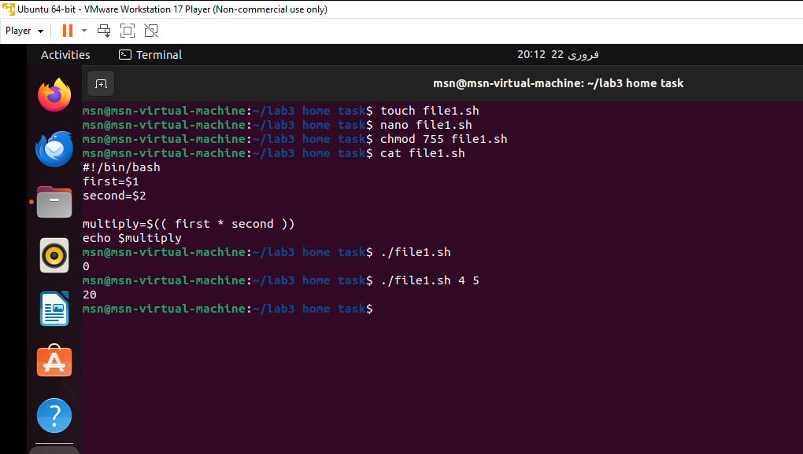
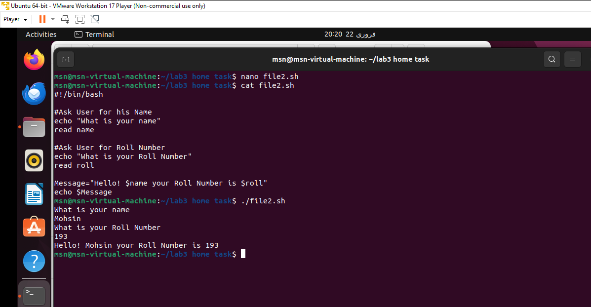
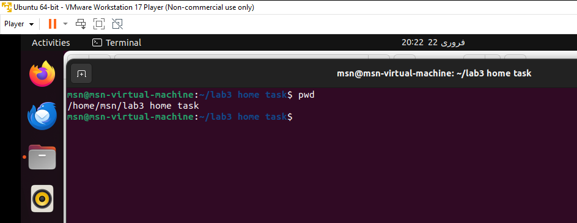
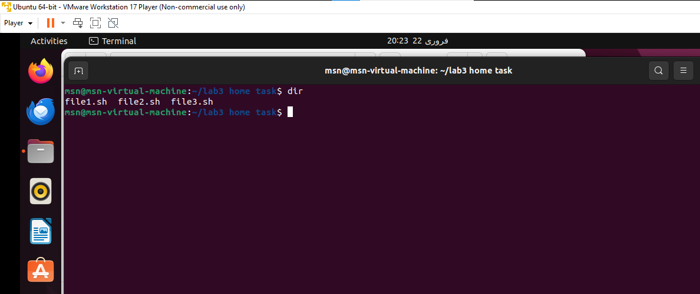
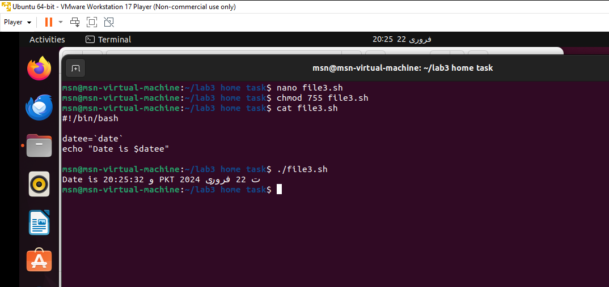
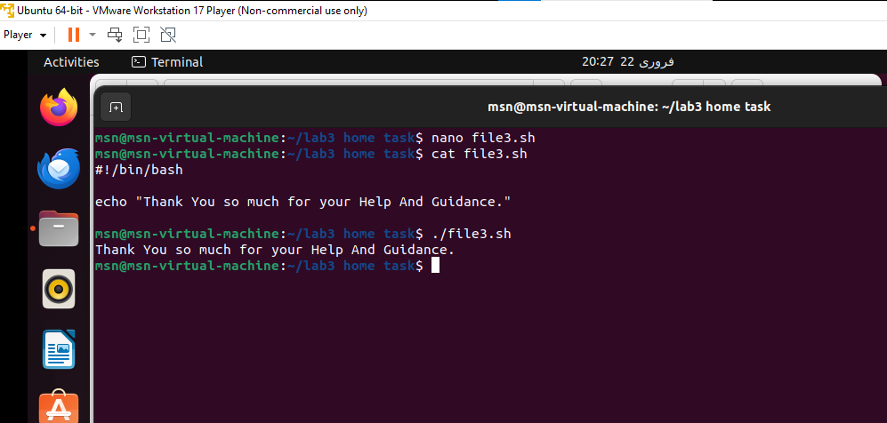
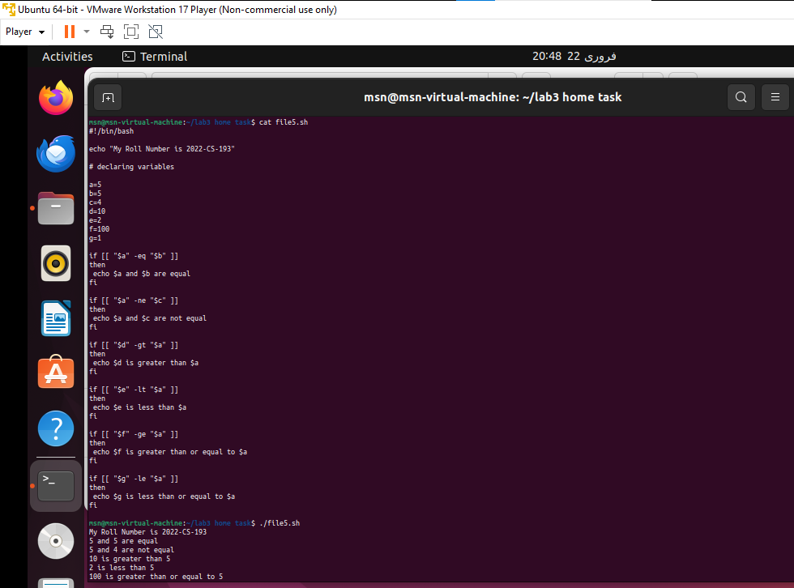

# TASK 1
## Question 1
Create a simple script which will take two command line arguments and then multiply them together

## Question 2.
Create a simple script, which will ask the user for a few pieces of information then combine this into a message which is echo'd to the screen

## Question 3.
Now Mr. Tom suddenly lost the track of his current location. Help him find his location

## Question 4.
He wants the list of all files present on home directory.

## Question 5.
Display the current time

## Question 6.
He is done with the task and he is happy with your work. He want to display a thankyou message.

# TASK 2
## Question 1.
Write a simple shell script that uses arithmetic operators (+, -,*) using double parenthesis with printing your own roll # with the results of operations.

## Question 2.
Write a simple shell script that uses all relational operators with printing your own roll # with the results of operations.
