---

---

<h1 id="downloading-windows-11-in-virtual-machine">Downloading Windows 11 in Virtual Machine</h1>
<h2 id="step-1.">Step 1.</h2>

First, go to Google, search VMware, and download it by clicking on the first link. 
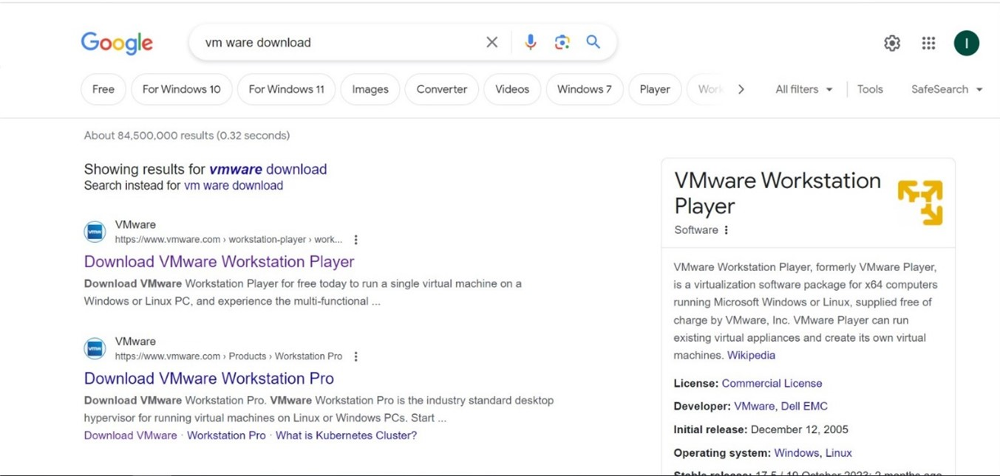

<h2 id="step-2.">Step 2.</h2>

Click on the <em>“GET STARTED”</em> and then continue. 
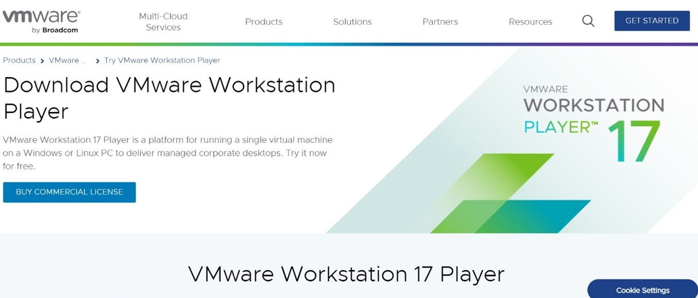

<h2 id="step-3.">Step 3.</h2>

Click on the <em>“TRY WORKSTATION 17 PLAYER FOR WINDOWS.”</em> 
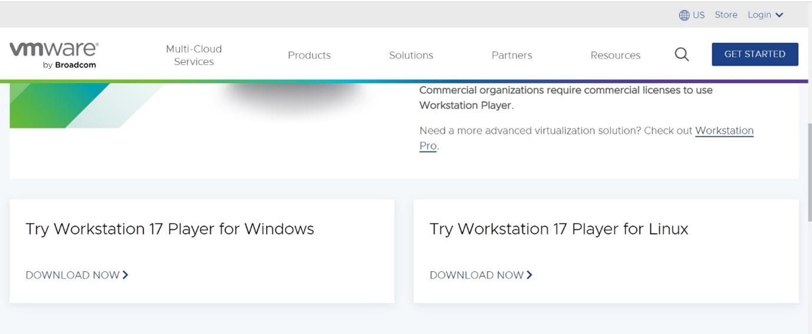

<h2 id="step-4.">Step 4.</h2>

Click on the <em>“Create a New Virtual Machine”</em> 
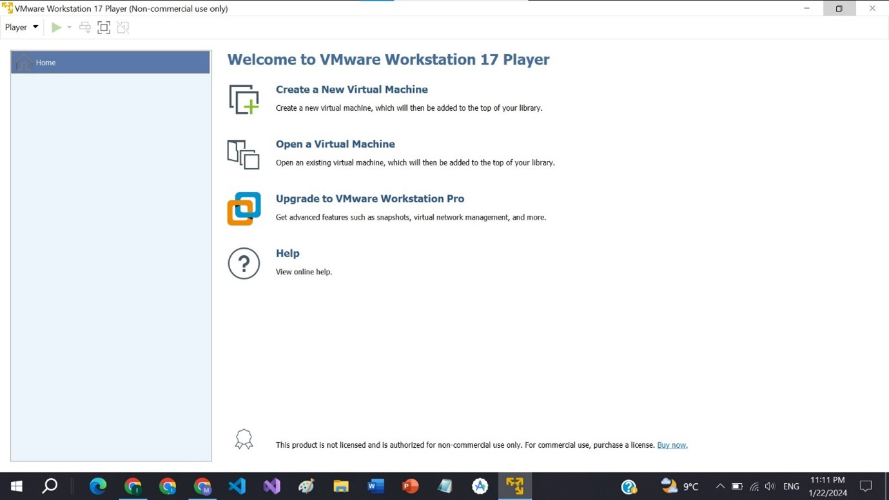

<h2 id="step-5.">Step 5.</h2>

Browse your “ISO file”  from your system and click on <em>“Next”</em> 
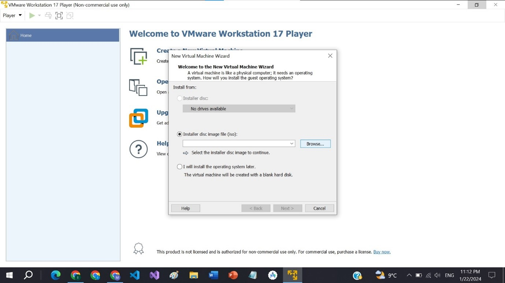

<h2 id="step-6.">Step 6.</h2>

Create a password for your virtual machine and click next. 
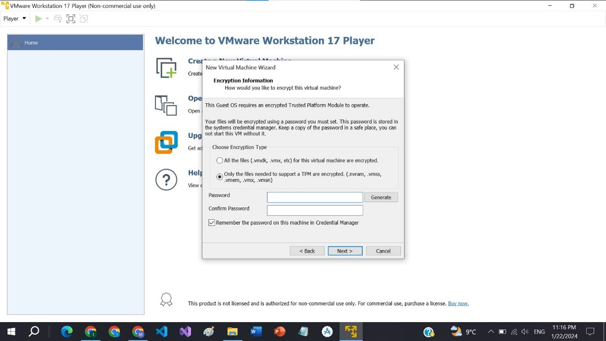

<h2 id="step-7.">Step 7.</h2>

Select a storage for your virtual machine and click on <em>“Next”</em> 
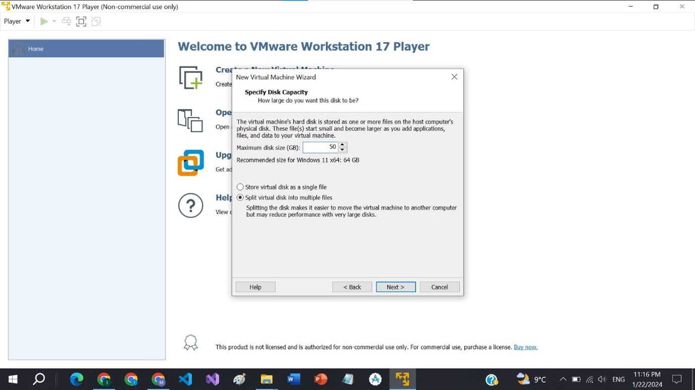

<h2 id="step-8.">Step 8.</h2>

Customize the hardware by clicking on <em>“Customize Hardware.”</em> 

<h2 id="step-9.">Step 9.</h2>

Make sure that a minimum of 4GB Memory is allocated if not then allocate 4GB RAM to it. You can increase this also depending on your system specifications. 
Click <em>“Next”</em> 
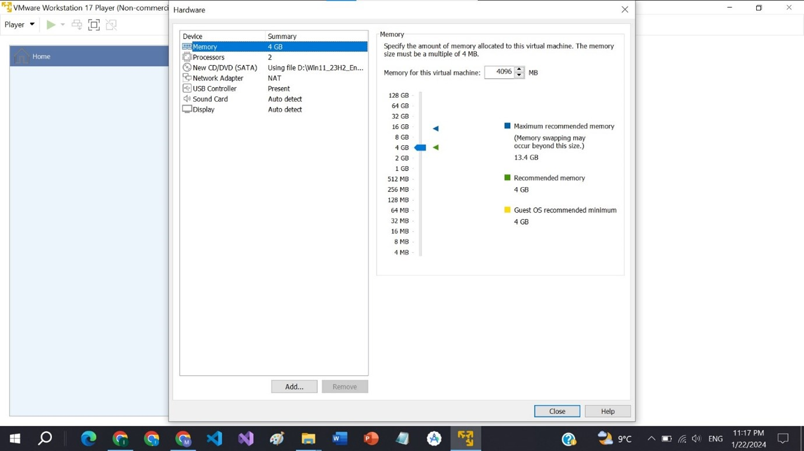

<h2 id="step-10.">Step 10.</h2>

The following interface will appear. 
Select the default language and click <em>“Next.”</em> 
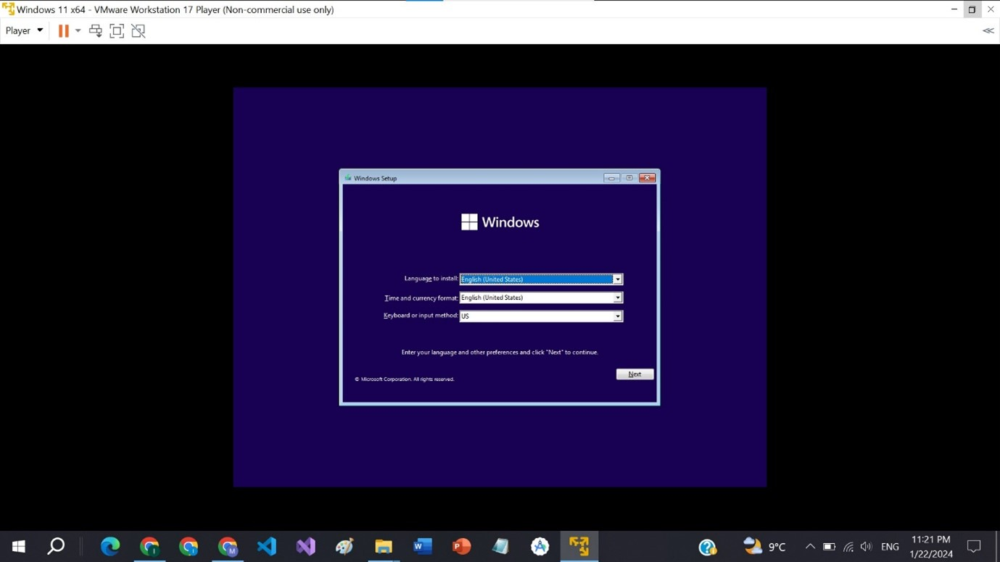

<h2 id="step-11.">Step 11.</h2>

Click on <em>“Install Now.”</em> 
Windows 11 will start installing. 
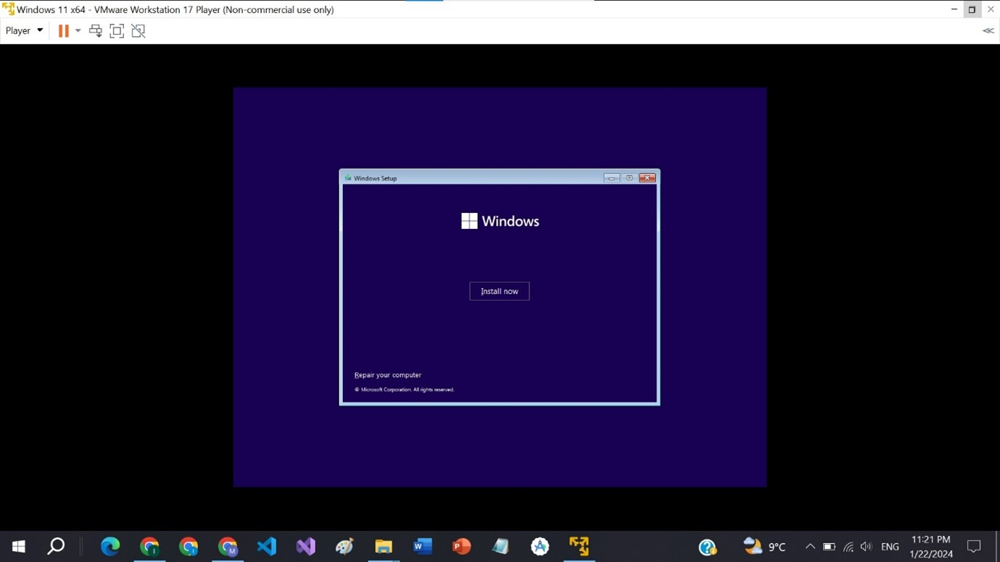

<h2 id="step-12.">Step 12.</h2>

Select <em>“Windows 11 Pro”</em> and click <em>“Next”.</em> 
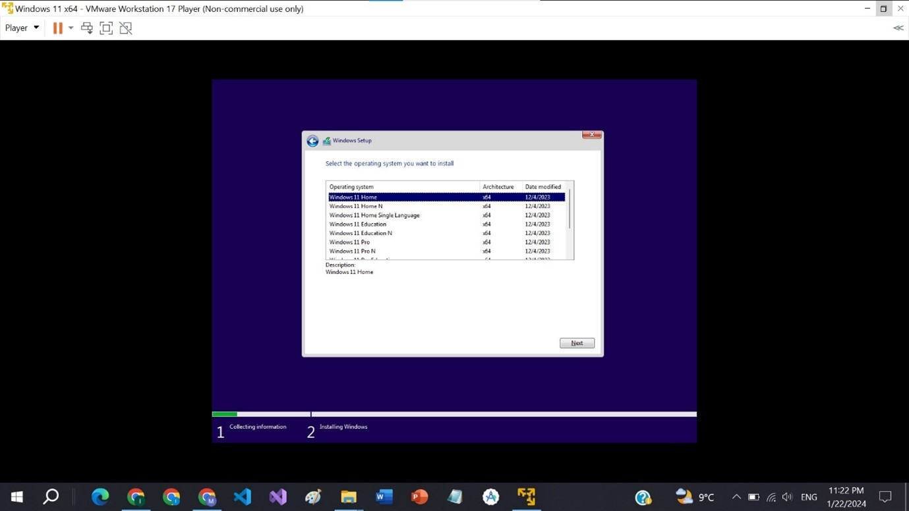

<h2 id="step-13.">Step 13.</h2>

Next, it will ask for the type of installation. 
Select <em>“Install Windows only”</em> and click <em>“Next”.</em> 
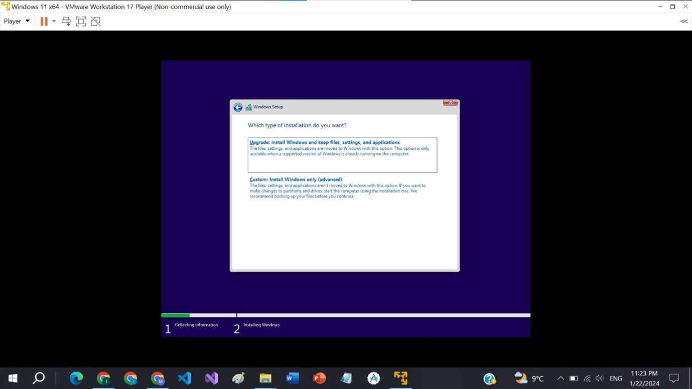

<h2 id="step-14.">Step 14.</h2>

Next, it will ask <em>" Where do you want to install the Windows".</em> 
Select the disk of your choice and click <em>“Next”.</em> 
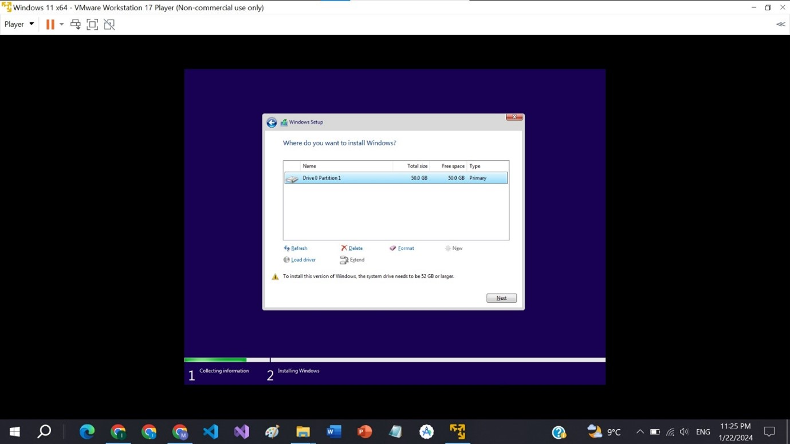

<h2 id="step-15.">Step 15.</h2>

After this, the Windows will complete the installation. 
After setting the accounts for the Windows, it will be installed. 
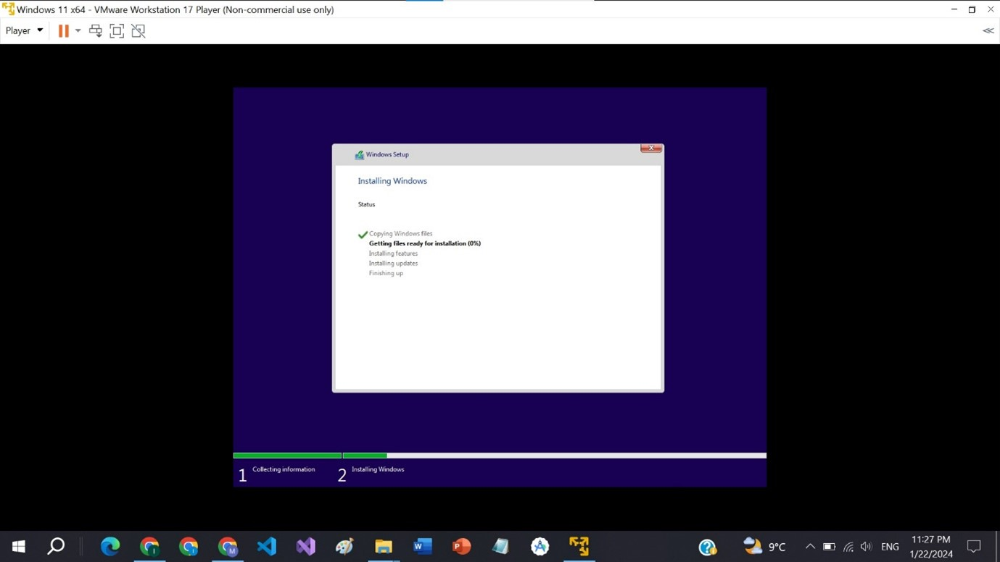

<h2 id="step-16.">Step 16.</h2>

Windows 11 has been installed successfully 
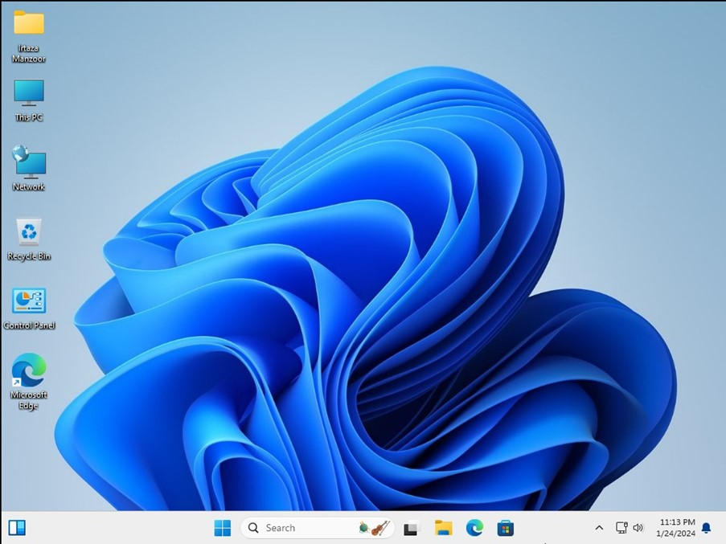

